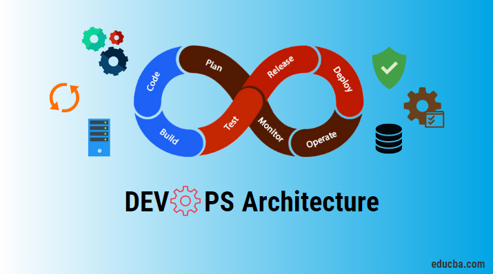
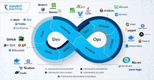

# What's DevOps

DevOps is the combination of cultural philosophies, practices, and tools that increases an organization's ability to deliver applications and services at high velocity: evolving and improving products at a faster pace than organizations using traditional software development and infrastructure management processes.

## Everything you need to know about DevOps...
* DevOps is a set of practices that combines software development (Dev) and information technology operations (Ops) to shorten the systems development life cycle and provide continuous delivery with high software quality. DevOps enables organizations to better serve their customers and compete more effectively in the market by breaking down silos between development and operations teams, enabling faster and more efficient delivery of software.

* The key principles of DevOps include automation, collaboration, monitoring, and measurement. Automation involves automating as much of the software development process as possible to reduce manual errors and increase efficiency. Collaboration involves breaking down silos between development and operations teams, promoting cross-functional communication and teamwork. Monitoring involves continuously monitoring the software development process and application performance to identify and address issues as quickly as possible. Measurement involves collecting and analyzing data to measure performance and identify areas for improvement.

# DevOps Tools...

* Some common DevOps tools and technologies include continuous integration and continuous delivery (CI/CD), containerization (using tools like Docker and Kubernetes), infrastructure as code (IaC), and cloud computing. DevOps also involves cultural and organizational changes, including creating a culture of trust and collaboration, empowering teams to take ownership of their work, and embracing failure as an opportunity to learn and improve.

* Overall, DevOps enables organizations to deliver software more quickly and reliably, while improving the quality of their products and services and enabling them to stay competitive in a rapidly changing market.

## Author
© Mofy Ally